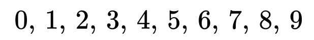
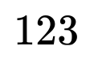
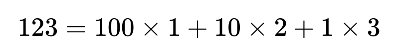
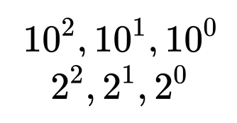
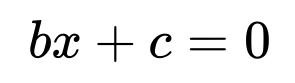
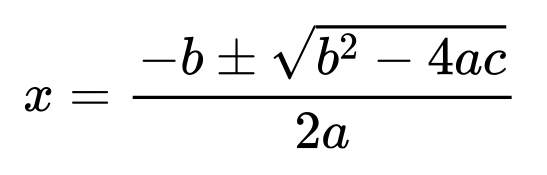
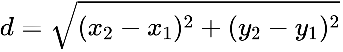
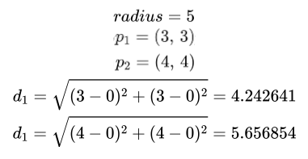

# Introduction to `C++` 

## About this course

The point of this course is understanding the basics and some advances concepts in `C++`. For ease of use and presentation `.Rmd` documents are used to produce this course. 

A custom `C++` engine is defined for this course. Compiles chunks to an executable, runs programme and returns the stdout to the `.Rmd` document. In some cases with `Rcpp` as an interface to `C++` when useful such as for plotting etc.

Some conventions: 

1. We will always use base 0 counting; the standard in `C++`.
1. `Rcpp.h` libraries are avoided in favour of the standard `C++` headers.
1. Code will more often than not be written in a function body; allows compilation and use in `R`'s context.

Use of `Rcpp.h` libraries will be kept to a minimum and information on compilation and using `C++` outside the context of `R` will be detailed.

Let's start with something simple; demonstrate that we can indeed write and compile `C++` in this context.

Here is a function which generates the Fibonacci sequence to `n` elements.

```cpp
#include <Rcpp.h>
using namespace Rcpp;

// 0, 1, 1, 2, 3, 5, 8, 13

// [[Rcpp::export]]
NumericVector fibonacci_cpp(int n) {
	NumericVector vec(n);
	
	vec[1] = 1;
	for(int i = 1; i < n; i++) {
		vec[i + 1] = vec[i - 1] + vec[i];
	}
	
	return vec;
}
```

```r
fibonacci_cpp(20)
```

```
##  [1]    0    1    1    2    3    5    8   13   21   34   55   89  144  233  377
## [16]  610  987 1597 2584 4181
```

## About `C++`

`C++` is a language invented by Bjarne Stroustrup in 1979. It is based on the `C` language and can be summarised as `C` with classes; object oriented programming.

`C++` is a low level, compiled, and powerful language. `C++` has become ubiquitous over the years and virtually all systems support compiling and running compiled `C++` code.

Printing "hello world" in typical `C++` would look something like this:

```cpp
#include <iostream>

int main() {
  std::cout << "Hello World!" << std::endl;
}
```

```
## Hello World!
```

`C++` is written in files with a `.cpp` extension. The output you see above was generated with our custom chunk engine, you can find the standalone code again in the "./cpp/" directory.

## Anatomy of a `C++` programme

A programme written in `C++` is typically structured as such:

Libraries are just code files that have been pre-written and offer some kind of utility. These typically end with a `.h` extension which stands for "header" as they are included at the top of a programme.

**Indeed** `C++` is executed in a linear fashion from first line to last.

Libraries are included at the top of a programme with the syntax: `#include <iostream>`.

Libraries can be stored locally to a project or on a system level. Libraries can be written by anyone; you could write helper functions and have it stored locally to your project.

Some libraries have become so common that they are stored in a single location for a computer. These can be included using the brackets `<name of library>` would do it. In the case that you want to include a locally stored header file you would use double quotes `"name of file"`.

A `main` function is always included in the programme and always returns an `int` (integer). This is because a success and failure to run is denoted with `0`/`1`.

A basic `C++` document would like this; note the function structure - parenthesis and curlies.

**Note**: comments are written with `//` or for multi-line between `/* comment here */`.


```cpp
#include <iostream> // library

int main() { // declare the type returned; and main function
	// do something
}
```

In our previous example we wrote: `std::cout << "Hello world!"`. This comes from the `iostream` library, the `std` signals that we're getting the `cout` function from that library. Finally, `<<` is an operator that pases the right hand statement as an input to the left hand.

**Important: ALL* lines in `C++` must be ended with a semi-colon - ;**. All statements that is. *In some cases like the end curly of a function we do not for example.

## Workflow

As stated before `C++` is a compiled language. This means we will often follow this routine of: 

1. Write programme.
1. Save programme.
1. Compile programme.
	1. If error; read error, go back to step 1.
1. Execute programme.
	1. If error; read error, go back to step 1.

So I previously showed you what some of the code looks like. Why don't I explain to you some of the magic of how to actually compile a programme?

Indeed I've set this all up to be compiled from the code chunks in this document auto-magically with the use of a custom chunk engine. But it's super simple I promise. I'll explain myself.

So what you typically do as we said; is we write the progamme, let's write one:


```cpp
#include <iostream>

int main() {
	std::cout << "Hello world." << std::endl;
}
```

```
## Hello world.
```

Ok now save the above to a text file with the extension `.cpp`.

Now try this command in your terminal:


```bash
c++ programme_name.cpp -o programme_name
```

What are we doing there? Well we're compiling the programme from the text file, `-o` denotes the output name/location of the programme executable.

So let's try it:


```bash
echo '#include <iostream>

int main() {
	std::cout << "Hello world." << std::endl;
}' > ./cpp/hello.cpp

c++ ./cpp/hello.cpp -o ./cpp/hello
```

So now we should have our programme in the cpp directory let's take a look:


```bash
ls ./cpp/hello*

echo ''

cat ./cpp/hello.cpp

rm ./cpp/hello
```

```
## ./cpp/hello
## ./cpp/hello.cpp
## 
## #include <iostream>
## 
## int main() {
## 	std::cout << "Hello world." << std::endl;
## }
```

The text file is there and we've compiled it.

You may be thinking what is a compiled programme anyway? Why do we have to "compile"? Well a compiler is simply a translator. All it does is it takes our `C++` code and translates it to what's commonly referred to as machine code; assembly. Assembly is an extremely low level langauge that then can be directly compiled to binary which is the true language of any computer.

Indeed we are using `C++` code to talk to the computer. `C++` has features and concepts which allow us to more easily reason about what we want to do. 

If you want to write a bit of code that will be repeated n amount of times, in `C++` you would you something called a for loop. It looks a little something like this:


```cpp
int times = 100;
for(int i = 0; i < times; i++) {
	// do something
}
```

That is just the pure for loop. Doesn't look so intimidating does it? We will go over it more in detail later. But it's telling the computer do what's inside these brackets n times.

Let's you wanted to write assembly; basically you would write a document and somewhere you'd tell it to JUMP back and repeat that code exactly with a new value for the iterator.

Why don't we write a loop, compile it and then try to take a look at what the assembly code looks like?

Here is a simple for loop, prints hello followed by the iterator 3 times.

```cpp
#include <iostream>

int main() {
	for(int i = 1; i <= 3; i++) {
		std::cout << "Hello " << i << std::endl;
	}
	
	return 0;
}
```

```
## Hello 1
## Hello 2
## Hello 3
```

Here we echo the code into a document and then compile it. Note the `-S` argument this tells the compiler to output assembly code.

```bash
echo 'int main() {
	int i;
	for(i = 1; i <= 3; i++) {
		int x = i;
	}
	
	return i;
}' > ./cpp/print_loop.cpp

c++ ./cpp/print_loop.cpp -o ./cpp/print_loop.asm -S
```

So now we've saved the code to a document, and compiled it. Let's take a look. 

**Note**: we've removed the print function and `<iostream>` from the code, as this includes a whole library which we don't really need. We just want to see what for loop looks like in assembly.

```bash
cat ./cpp/print_loop.asm
```

```asm
	.section	__TEXT,__text,regular,pure_instructions
	.build_version macos, 11, 0	sdk_version 11, 3
	.globl	_main                           ## -- Begin function main
	.p2align	4, 0x90
_main:                                  ## @main
	.cfi_startproc
## %bb.0:
	pushq	%rbp
	.cfi_def_cfa_offset 16
	.cfi_offset %rbp, -16
	movq	%rsp, %rbp
	.cfi_def_cfa_register %rbp
	movl	$0, -4(%rbp)
	movl	$1, -8(%rbp)
LBB0_1:                                 ## =>This Inner Loop Header: Depth=1
	cmpl	$3, -8(%rbp)
	jg	LBB0_4
## %bb.2:                               ##   in Loop: Header=BB0_1 Depth=1
	movl	-8(%rbp), %eax
	movl	%eax, -12(%rbp)
## %bb.3:                               ##   in Loop: Header=BB0_1 Depth=1
	movl	-8(%rbp), %eax
	addl	$1, %eax
	movl	%eax, -8(%rbp)
	jmp	LBB0_1
LBB0_4:
	movl	-8(%rbp), %eax
	popq	%rbp
	retq
	.cfi_endproc
                                        ## -- End function
.subsections_via_symbols
```

In summary from the above we can see how compiling works. You write some code then you use a compiler programme which translates your code to assembly/machine code.

The command would look something like this as we used above:

```bash
c++ ./cpp/print_loop.cpp -o ./cpp/print_loop -S
```

## Data structures and data types

### Types

You've seen the `int` prefix in the code I've shown you before. Notably before the main function. As I said before all variables and functions must have their type declared. Here we'll go over some data types and data structures of `C++`.

The primitive data types, those built into `C++`, are:

1. `int`: integer numbers.
1. `double`: used for storing double precision floating point numbers/decimal numbers.
1. `float`: stores single precision floating point numbers/decimal numbers.
1. `char`: individual characters; corresponding to ASCII table value maxes out at 256.
1. `string`: a sequence of characters.
1. `wchar_t`: characters; corresponding to UNICODE table value maxes out at 65,536.
1. `bool`: a true/false or logical - 0 and 1 can also be used and cast to a `bool`.
1. `void`: no value, represents a valueless entity; typically used for functions that return nothing.

Note that you can also have modified types; these are types with a modifier:

1. `signed`: a number type which can be both positive and negative.
1. `unsinged`: a number type which can only be positive.
1. `short`: this is used for small integers in a range between -32768 and 32767.
1. `long`: used for large numbers.

### Information theory

Different types have different properties, specifically referring to memory use. On most machines (depending on the architecture) a variable takes up anywhere from 1 byte to 12 bytes of memory (called memory allocation).

What even is memory? What is information? How is information stored? When working with computers or even with other humans we all have to agree as to how we are going to represent information. One way of representing information is to count things on the digits of your hand. One finger is one, two is two etc. with this we can count to ten.

We also work with other kinds of numbers, decimal numbers; technically base 10 numbers. This refers to the fact that there are 10 symbols which are used for counting. These are 0 to 9.

<!-- $$
	0,\,1,\,2,\,3,\,4,\,5,\,6,\,7,\,8,\,9
$$ --> 

<div align="center"></div>

However computers don't speak the same language as us. Their language is much more simple. Computers use a base 2 system or known as binary. Indeed, they count with two symbols. For a computer a single value, either a 0 or 1, is known as a bit; this is derived from the combination of two words binary and digits.

The reason for such a simple system is because of the fact that computers are built on electronic devices called transistors. Transistors are simply gates for electricity, they either let electricity through or don't; on or off.

Here we represent counting with a single bit. We are limited to counting with two symbols on or off, or 0 to 1. Let this dot represent a "light bulb", yellow means it's on or 1.

<div align="center"></div>

You might be thinking if we only have two symbols 0 and 1, how can we count higher than 1? Well we could use more than one bit (value 0/1) in different combinations to represent different values.

Using bits in different combinations to represent numbers is something similar to what we already do with our own number system. Imagine 0 - 9; the numbers 1, 2 and 3 can be all placed next to each other to represent what we instinctively know as one-hundred twenty three.

<!-- $$
	123
$$ --> 

<div align="center"></div>

Note that each digit in this number represents a place of value: 1 - hundreds place, 2 tens place, and 3 the ones place. So the solution here:

<!-- $$
	123 = 100 \times 1 + 10 \times 2 + 1 \times 3
$$ --> 

<div align="center"></div>

The binary system is the same expect they don't use 9 symbols but 2! We have the number 10 to represent our 10 symbols (0 - 9) and the 2 the two of the computer (0 - 1). These exponents are in essence telling us how many values each place can represent; 10 ^ 2 = 100.

<!-- $$
	 10 ^ 2, 10 ^ 1, 10 ^ 0 \\
	 2 ^ 2, 2 ^ 1, 2 ^ 0 
$$ --> 

<div align="center"></div>

So we humans have ones place, tens, then hundreds place. Computers with their binary systems have ones place, twos place, and fours place. Simply resolve the above expressions.

If we have 1 bit we can count from 0 to 1. How high could we count if we have three bits?

<div align="center"></div>

The above illustration shows us what it would be like to count with 3 bits. What we did was organise our bits in all possible combinations and these can be used to represent a numerical value. Note that we start counting at 0 and thus we can only get as high as 7 if we have 3 bits. The more bits you have the higher you can count.

### Types and bytes

As you might know 1 byte is equal to 8 bits. A single bit is the smallest unit of memory. We will typically work with whole bytes as that is what is accessible to us. Working with a single individual bit is in essence impossible, a variable must have an associated address which also occupies some amount of space.

As an example note that an `int` is typically 4 bytes in size. This equates to: 4 bytes each 8 bits in size. So we have a total of 32 bits to store information in.

Okay but what in the heck is a bit? A bit as you might know is the smallest unit by which we can measure memory. It is either on or off, 0 or 1. This is commonly known as binary! 

So as we said before we have 32 0s and 1s in which to store information with an `int` data type. These can individually be in the 0 or 1 state. 

How is information even stored? For example let's think we have 0s and 1s to work with.

Typically these are the sizes of the following types:

Data Type | Size (in bytes) | Range
-- | -- | --
short int | 2 | -32,768 to 32,767
unsigned short int | 2 | 0 to 65,535
unsigned int | 4 | 0 to 4,294,967,295
int | 4 | -2,147,483,648 to 2,147,483,647
long int | 4 | -2,147,483,648 to 2,147,483,647
unsigned long int | 8 | 0 to 4,294,967,295
long long int | 8 | -(2^63) to (2^63)-1
unsigned long long int | 8 | 0 to 18,446,744,073,709,551,615
signed char | 1 | -128 to 127
unsigned char | 1 | 0 to 255
float | 4 |  
double | 8 |  
long double | 12 |  
wchar_t | 2 or 4 | 1 wide character

Let's start with some numbers. You can declare a number first, then attribute a value. The important step with anything in `C++` is delcaring the type.


```cpp
#include <iostream>

int main() {
	int yeet; // declare yeet
	
	yeet = 1; // set equal to 1
	
	std::cout << yeet << std::endl;
	
	yeet = 2; // reset to 2
	
	std::cout << yeet << std::endl;
	
	int zoot = 131; // declare and set zoot
	
	std::cout << zoot << std::endl;
	
	int xoot = yeet + zoot; // declare and set xoot as sum of yeet + zoot
	
	std::cout << xoot << std::endl;
	
	return 0;
}
```

```
## 1
## 2
## 131
## 133
```

As you can see our variable `yeet` was declared and then set to equal 1, then subsequently equal to two and printed again.

**Note**: adding and arithmetic functions are as natural as +/-. Let's go over some maths yes?

## Arithmetic operators

In `C++` we have these as the following primitive arithmetic operators. Primitive because they are built into the language. You'll notice when you start needing more complex things such as n to the power of x you'll need some libraries.

- `+` addition.
- `-` subtraction.
- `*` multiplication.
- `/` division.
- `%` modulo; gets the remainder after the division.


```cpp
#include <iostream>

int main() {
	double score = 0;
	
	score = score + 20;
	std::cout << score << std::endl;
	
	score = score - 2;
	std::cout << score << std::endl;
	
	score = score * 3;
	std::cout << score << std::endl;
	
	score = score / 2;
	std::cout << score << std::endl;
	
	score = (int) score % 3;
	std::cout << score << std::endl;
	
	return 0;
}
```

```
## 20
## 18
## 54
## 27
## 0
```

Notice in the last operation I put `(int)` before taking modulo 3, this is something called type casing and we will learn more about it in the future.

## Project: quadratic maths

Let's put together what we've learned and make a programme that can solve the quaradtic formula. We'll also visualise what we do with some `R` code.

What even is the quadratic formula? Well a quadratic formula is a mathematical formula that allows you to find the solutions to a quadratic equation... 

I know, never define a word by using the word in the definition! Stick with me. A quadratic (meaning square or 4 in latin) equation is an equation that fits the form of:

<!-- $$
	ax ^ 2 + bx + c = 0
$$ --> 

<div align="center"></div>

1. `x` represents a variable.
1. `a, b, c` represent known numbers; `a != 0`.

What's going on in this equation to put things simply; you input a value for `x` and you get `y` back. You can then plot these!

Shifting the values of `a, b, c` is what defines different quadratic functions.

Note that if a is equal to zero then the equation simply becomes linear: 

<!-- $$
	bx + c = 0
$$ --> 

<div align="center"></div>

Let's try it out and visualise. Here we define a function to calculate quadratic coordinates.

In order to get the values back for plotting we'll use `R`'s flavour of `C++`. We'll use `Rcpp`'s header file. Some other changes to note is no `main()` function, this is because the code is compiled by `Rcpp` the imported as a function to `R`.

Note the `using namespace Rcpp;` line; this means we can directly use the library without having to append everything with `Rcpp::`function_name. You can do the same thing with `std`.

Let's dissect the following code. This is 99% `C++` with a little bit of `Rcpp` in there just for getting back the function in here.


```cpp
#include <Rcpp.h>
#include <vector>

// [[Rcpp::export]]
std::vector<double> quadraticReturnY(std::vector<double> x, double a, double b, double c) {
	int n = x.size();
	
	std::vector<double> y(n);
	
	for(int i = 0; i < n; i++) {
		y[i] = (a * (x[i] * x[i])) + (b * x[i]) + c;
	}
	
	return y;
}
```

Here you see `<vector>`, what is a vector? A `vector` is a sort of super array defined in the standard library. It has some nice methods attached to it so we can get it's size easily like shown above for example: `x.size();`

Note that we are creating a `vector` with the following syntax: `std::vector<double>`. This is saying get the `vector` class from the standard library, and we're putting numbers inside this `vector` of type double.

What we're saying here is input to this function a `vector`, and some other variables. Do some calculations and return the `vector` of results y.

Let's then calculate the coordinates for a quadratic function of the following parameters:

1. `a = 1`
1. `b = 0`
1. `c = 0`


```r
a <- 1
b <- 0
c <- 0

x <- -20:20
y <- quadraticReturnY(x, a, b, c)

df <- data.frame(x = x, y = y)

head(df, 5)
```

```
##     x   y
## 1 -20 400
## 2 -19 361
## 3 -18 324
## 4 -17 289
## 5 -16 256
```


```r
if(df$y[which.max(abs(df$y))] > 0) {
	lim <- c(-15, NA)
} else {
	lim <- c(NA, 15)
}

ggplot2::ggplot(df, ggplot2::aes(x = x, y = y)) +
	ggplot2::geom_line() + 
	ggplot2::scale_y_continuous(limits = lim) +
	ggplot2::geom_hline(yintercept = c, linetype = "dashed", colour = "goldenrod", size = 1) +
	ggplot2::labs(title = "A classic quadratic plot", subtitle = stringr::str_interp('a = ${a}, b = ${b}, c = ${c}, x = [${min(x)} ... ${min(x)}]'))
```

<div align="center"></div>

Notice how if we shift the values we move the plot around:


```r
a <- 1.4
b <- 40
c <- -4

x <- -30:20
y <- quadraticReturnY(x, a, b, c)

df <- data.frame(x = x, y = y)

ggplot2::ggplot(df, ggplot2::aes(x, y)) +
	ggplot2::geom_line() + 
	ggplot2::geom_hline(yintercept = -4, linetype = "dashed", colour = "goldenrod", size = 1) +
	ggplot2::labs(title = "A shifted quadratic plot", subtitle = stringr::str_interp('a = ${a}, b = ${b}, c = ${c}, x = [${min(x)} ... ${min(x)}]'))
```

<div align="center"></div>

So in the examples above we're asking the formula to give us back the `y` values for an array of `x`s.

Notice how the parabola at some point crosses the x axis. At this point y really does equal 0. This is called a solution, or a root to this equation. The equation is defined by the a, b and c constants in the context of the quadratic formula shown before.

There exists two roots, as a parabola has two arms, these are two solutions or two points where the arms intersect the x-axis. These points can be found by plugging these same constants into this formula.

Note if your parabola is shifted above the x-axis it's possible you have no real solutions.

Let's implement this formula for calculating a solution to the above shown parabola.

<!-- $$
	x = \frac{-b \pm \sqrt{b ^ 2 - 4ac}}{2a}
$$ --> 

<div align="center"></div>


```cpp
#include <Rcpp.h>
#include <math.h>
using namespace Rcpp;

// [[Rcpp::export]]
std::vector<double> quadraticRoots(double a, double b, double c) {
	
	std::vector<double> x(2);
	
	x[0] = (-b + std::sqrt((b * b) - (4 * a * c))) / (2 * a);
	x[1] = (-b - std::sqrt((b * b) -( 4 * a * c))) / (2 * a);
	
	return x;
}
```

Wonderful as we can see the roots or solutions to this quadratic formula are these! Note that if you were to plot these as points on the graph where these correspond to the x value (if y = 0) then you would find that these are indeed the points where the parabola's arms cross the x-axis.

```r
quadraticRoots(a, b, c)
```

```
## [1]   0.09965243 -28.67108100
```

Here's the same plot again, with the points we just calculated as red circles! Amazing!

```r
df2 <- data.frame(x = quadraticRoots(a, b, c), y = rep(0))

ggplot2::ggplot() +
	ggplot2::geom_line(data = df, ggplot2::aes(x, y)) +
	ggplot2::geom_point(data = df2, ggplot2::aes(x, y), colour = "red", size = 5, alpha = 0.5) +
	ggplot2::geom_hline(yintercept = -4, linetype = "dashed", colour = "goldenrod", size = 1) +
	ggplot2::labs(title = "A shifted quadratic plot", subtitle = stringr::str_interp('a = ${a}, b = ${b}, c = ${c}, x = [${min(x)} ... ${min(x)}]'))
```

<div align="center"></div>

## Conditionals and logic

In `C++` conditonals and control flow is pretty straight forward as in most languages:


```cpp
#include <iostream>

int main() {
	bool yeet = true;
	std::string mom_location = "home";
	int people = 9;
	
	if(yeet & (mom_location != "home")) {
		std::cout << "Mother's home no yeeting!" << std::endl;
	} else if(((bool) people % 3) & yeet) {
		std::cout << "We have enough yeets for all and mother is not home! YEET!" << std::endl;
	} else {
		std::cout << "We don't have enough yeets, but we have some!" << std::endl;
	}
	return 0;
}
```

```
## We have enough yeets for all and mother is not home! YEET!
```

Above we demonstrate a number of concepts. Let's enumerate them here:

- `==` a comparator, is left side equal to right side.
- `!=` not equal to.
- `>` greater than.
- `<` less than.
- `>=` greater than or equal to.
- `<=` less than or equal to.

Notice how we're catching if the first condition is not met then the second is checked, finally the last statement is executed as a catch all.

If we start having a large number of conditions things can get convoluted. A `switch` statement is suggested.

Note a switch must always evaluate to a integral type: `int`, `char`, `short`, `long`, `long long`, `enum`.

The case keyword checks if the expression fed matches the value after. Break tells the computer to exit the block and not run the other cases. At the end there is a default case as a catch all.

```cpp
#include <iostream>
#include <random>

int main() {
	int bedrooms = 9;
	
	switch(bedrooms) {
		case 1 :
			std::cout << "The house is cheap" << std::endl;
			break;
		case 2 :
			std::cout << "Starter home" << std::endl;
			break;
		case 3 :
			std::cout << "Mid sized house for a family." << std::endl;
			break;
		case 4 :
			std::cout << "Okay big house!" << std::endl;
			break;
		default :
			std::cout << "Why do you need so many rooms!?" << std::endl;
			break;
	}
	return 0;
}
```

```
## Why do you need so many rooms!?
```

## Logical operators

Above you might have noticed I used `&` inside one of the if statements. This is a conditional operator. Conditional operators combine booleans and output a single condition. In essense these are different kinds of logic gates. 

- true + true = true
- true + false = false
- false + true = false

And so on.

- `&&` and.
- `||` or.
- `!` not.


```cpp
#include <iostream>

int main() {
	std::cout << "1 < 2 && 2 > 3: " << (1 < 2 && 2 > 3) << std::endl;
	std::cout << "1 < 2 || 2 > 3: " << (1 < 2 || 2 > 3) << std::endl;
	return 0;
}
```

```
## 1 < 2 && 2 > 3: 0
## 1 < 2 || 2 > 3: 1
```

## Loops

I've previously used some loops in my code. Let's go over them in more detail and see how they work and what kinds of loops we have available.

- `while` much like an if statement; however, it will continue to execute the code inside until the condition is met.
- `for` a loop with constructors, will continue while the defined index is still not meeting the condition; should increment to eventually meet the condition.

Let's try a while loop. Here we will calculate the square of a number i from 0 to 9.


```cpp
#include <iostream>

int main() {
	int i = 0;
	
	while(i < 10) {
		std::cout << i << " " << i * i << std::endl;
		i++;
	}
	return 0;
}
```

```
## 0 0
## 1 1
## 2 4
## 3 9
## 4 16
## 5 25
## 6 36
## 7 49
## 8 64
## 9 81
```

Let's take a look at a for loop now. A little more complicated but still straight forward. A for loop has four separate parts; the key word `for` is used to declare one:

1. Initialisation, the counter: `int i = 0`
1. Condition: `i < 20`
1. Incrementor: `i++`

Let's make one with slightly different parameters just to see what we can do.


```cpp
#include <iostream>

int main() {
	for(int i = 26; i > 14; i -= 4) {
		std::cout << i << std::endl;
	}
	return 0;
}
```

```
## 26
## 22
## 18
```

Note we started not at 0 but 26, we're checking that our counter is not below 14, and finally decrementing by 4; you can use `-=`/`+=` or even `i--`/`i++`.

## Debugging `C++`

This is a very important section, if your an experiences programmer you know how important it can be to be able to read error messages and debug with break points or other. 

Errors are often encountered for a few different kinds of reasons:

- Compile time errors: found by the compiler.
- Line-time errors: found by the linker when glueing code together.
- Run-time errors: found by checks in the running programme.
- Logic errors: errors caused by the programmer.

### Compile time errors

```cpp
#include <iostream>

int main() {
	int yeet = "nope";
	return 0;
}
```

```
## ./cpp/chunk_13.cpp:4:6: error: cannot initialize a variable of type 'int' with an lvalue of type 'const char [5]'
##         int yeet = "nope";
##             ^      ~~~~~~
## 1 error generated.
```

The error message above shows very clearly what the mistake was. We're declaring a variable of type int and assigning a string type to it.

### Link time errors

Linker errors look a little more like this:

```bash
cat '#include <iostream>

int Main() {
	int yeet = 1;
	
	return 0;
}' > ./cpp/linker-fail.cpp

c++ ./cpp/linker-fail.cpp -o ./cpp/linker-fail
```

```
## cat: #include <iostream>
## 
## int Main() {
## 	int yeet = 1;
## 	
## 	return 0;
## }: No such file or directory
## Undefined symbols for architecture arm64:
##   "_main", referenced from:
##      implicit entry/start for main executable
## ld: symbol(s) not found for architecture arm64
## clang: error: linker command failed with exit code 1 (use -v to see invocation)
```

We can see that compilation works fine in this case but it fails when trying to link. 

### Run time errors

Just because a programme compiles and links does not mean it is safe. These error show up when running. An example of a common mistake is division by 0. The compiler nor the linker can catch these error but occur when the programme is executed and values are set. Another common mistake is opening a file that does not exist.


```cpp
#include <iostream>

int main() {
  
  int width = 20;
  int length = 0;
  
  int ratio = width / length;
  
  std::cout << ratio << std::endl;
}
```

```
## 0
```

### Logic errors

These errors can be hard to spot depending on the complexity of the programme. Sometimes you might just forget that you need to return from an if statement, or that once all conditions are met you need to return from the whole programme etc.

The possibilities are endless. Note that logic errors don't produce error messages. These are technically not errors to the computer, but simply do not do what we want the programme to do.

There really is no example I can show you here. Just pay close attention to your logic and control structures.


## Vectors and arrays

So far we've been working with relatively simple data structures. In this section we will learn how to create, manage and manipulate vectors and arrays. Simply put these are data structures capable of holding more than one element of an object. For example we could have a vector of multiple numbers.

### Vectors

A vector is a template class built on arrays. It is a `C++` only construct. It is implemented as a dynamic array; meaning it can grow and shrink dynamically. Memory management is automatic and freed when the vector shrinks.

Vectors can be passed to or returned from functions, they can be copied and assigned (these both perform deep copies in memory).

Note that vectors do not decay to pointers but you can get a pointer to the data as `&vec[0]`. 

Attached to vectors are a few extras. They always have attached their size or how many elements they hold and capacity or how many elements can be stored in the currently allocated block of memory.

In order to use vectors you need to use the `vector` header from the `stl`.


```cpp
#include <iostream>
#include <vector>

int main() {
	std::vector<int> vec(3);
	
	for(int i = 0; i < 3; i++) {
		vec[i] = i * 3;
	}
	
	std::cout << vec[1] << std::endl;
}
```

```
## 3
```

In the above example we are very simply initialising a vector of size 3. You can initialise with values all on one line.

**Note**: this is a feature found in C++ 11 and up. Use the flag `-std=c++17` when compiling.


```cpp
#include <iostream>
#include <vector>

int main() {
	std::vector<double> coord = {94.87422, 84.29302};
	
	std::cout << coord[0] << std::endl;
}
```

```
## 94.8742
```

Note the use of `[]` brackets to access elements of the vector. Indices start at 0.

If you want to grow a vector use the method `.push_back()` on it. This modifies the vector in place and adds the element to the end.

If you come from a functional programming language this may be a bit weird. But we don't need to make a copy on every modification, instead we can modify the object in place and just update that bit of memory.


```cpp
#include <iostream>
#include <string>
#include <vector>
#include <random>
#include <chrono>

std::mt19937 rng(std::chrono::steady_clock::now().time_since_epoch().count());

int main() {
	std::vector<std::string> dna = {"ATG", "CAA"};
	
	std::cout << dna[dna.size() - 1] << std::endl;
	
	dna.push_back("HIYA");
	
	std::cout << dna[dna.size() - 1] << std::endl;
	
	dna.pop_back();
	
	std::cout << dna[dna.size() - 1] << std::endl;
	
	return 0;
}
```

```
## CAA
## HIYA
## CAA
```

Above we're creating a vector holding elements of type string. We're getting the size of the vector via the method `.size()`: `std::cout << dna.size() << std::endl;`. This is used to see what the last element of the vector as and print; what we observe is that the methods `.push_back()` and `.pop_back()` have an effect on the vector.

We add the string "HIYA" at one point and then print the last element. Then we remove it and re-print the last element and we again see "CAA".

Note that we do `dna.size() - 1` to get the last element of the vector. This is because the `.size()` method returns the number of elements of that vector and not the index!


```cpp
#include <iostream>
#include <vector>

int main() {
	std::vector<int> vec = {2, 4, 3, 6, 1, 9};
	
	int even_sum = 0;
	int odd_prod = 1;
	
	for(int i = 0; i < vec.size(); i++) {
		if(vec[i] % 2 == 0) {
			even_sum += vec[i];
		} else {
			odd_prod *= vec[i];
		}
	}
	
	std::cout << even_sum << std::endl;
	std::cout << odd_prod << std::endl;
	
	return 0;
}
```

```
## 12
## 27
```


## Project: calculate pi with Monte Carlo

Let's calculate the constant Pi using Monte Carlo. The concept is very simple once understood. Imagine a square of width 10, inside this square you inscribe a circle of radius 5.


```r
par(bg = "black", mar = rep(0, 4)) # , col = "black", col.axis = "white"
plot(c(-5, 5), c(-5, 5), type = "n", asp = 1, xlab = "", ylab = "")
symbols(x = 0, y = 0, squares = 10, inches = FALSE, add = TRUE, fg = "white")
symbols(x = 0, y = 0, circles = 5, inches = FALSE, add = TRUE, fg = "white")
```

<div align="center"></div>

Now throw some darts at this target, your dart must land within the square. When hitting the board there is a possibility it will be inside the circle, and if not then inside the square (edges). Note that without knowing Pi we can calculate if anyone of these points are inside the circle or not using the Pythagorean Theorem.

<!-- $$
	d = \sqrt{(x_2 - x_1) ^ 2 + (y_2 - y_1) ^ 2}
$$ --> 

<div align="center"></div>

We know the radius of the circle since it's inscribed in the square of width 10; 5. Thus we can calculate the distance from the centre of the construct, **if** the distance is greater than 5 then the point must be outside the circle and if less then it falls inside the circle.


```r
par(bg = "black", mar = rep(0, 4)) # , col = "black", col.axis = "white"
plot(c(-5, 5), c(-5, 5), type = "n", asp = 1, xlab = "", ylab = "")
symbols(x = 0, y = 0, squares = 10, inches = FALSE, add = TRUE, fg = "white")
symbols(x = 0, y = 0, circles = 5, inches = FALSE, add = TRUE, fg = "white")

points(3, 3, col = "green", pch = 19, cex = 2)
points(4, 4, col = "red", pch = 19, cex = 2)
```

<div align="center"></div>

<!-- $$
	radius = 5 \\
	p_1 = (3,\,3) \\
	p_2 = (4,\,4) \\
	d_1 = \sqrt{(3 - 0) ^ 2 + (3 - 0) ^ 2} = 4.242641 \\
	d_1 = \sqrt{(4 - 0) ^ 2 + (4 - 0) ^ 2} = 5.656854
$$ --> 

<div align="center"></div>

From our simple plot and calculations above we see that point 1 (p1) does fall inside the circle and point 2 (p2) does not. 

Okay wonderful! So what, we can calculate if some dots randomly fall inside our outside a circle? What does that have to do with calculating Pi?

Well I'll tell you; if you tally up how many are inside and how many are outside, and you take the ratio those inside and the total you will find that number equals Pi. Don't believe me? Let's do it.

We will use some `Rcpp.h` sugar just to get back a `data.frame` and plot.


```cpp
#include <Rcpp.h>
#include <random>
#include <chrono>
#include <math.h>

using namespace Rcpp;

std::mt19937_64 rng(std::chrono::steady_clock::now().time_since_epoch().count());

// [[Rcpp::export]]
List monteCarloPi(double iterations) {
	NumericVector x(iterations);
	NumericVector y(iterations);
	NumericVector colour(iterations);
	
	double circle = 0;
	double width = 1;
	
	for(int i = 0; i < iterations; i++) {
		x[i] = std::uniform_real_distribution<double>(0, width)(rng);
		y[i] = std::uniform_real_distribution<double>(0, width)(rng);
		
		if(std::sqrt(x[i] * x[i] + y[i] * y[i]) <= width) {
			circle++;
			colour[i] = 1;
		} else {
			colour[i] = 0;
		}
	}
	
	double pi = (circle / iterations) * 4.0;
	
	DataFrame df = DataFrame::create(_["x"] = x, _["y"] = y, _["colour"] = colour);
	
	return List::create(_["pi"] = pi, _["calc"] = df);
}
```

Okay let's review what this code does. Note here I include the most robust way to get a random number that I've found. Other methods are limited by the byte size of the type generated thus max out at a certain size of random number. Here we're using a 64 bit type.

We start by seeding with the time. We create x and y vectors, I also include a colour vector which will track if the coordinates fall inside our outside the circle.

We define our tally with circle initially at 0 and the width of our geometric construct at 1. It really doesn't matter what width you choose so long as the numbers you generate are coherent with these sizes.

A for loop allows us to randomly generate values for x and y for n times. In this loop we also tally those coordinates which fall inside the circle and increment the circle counter.

Finally we are calculating for 1/4 of the circle's area thus our value is multiplied by 4. We add everything to a `data.frame` then a list and return to R.

Below is the visual result!


```r
res <- monteCarloPi(100000)

par(bg = "black", mar = c(0.75, 0.75, 1.5, 0))
plot(res$calc[res$calc$colour != 1, "x"], res$calc[res$calc$colour != 1, "y"], cex = 0.1, col = "red", main = stringr::str_interp('Pi calculated: ${res$pi}'), col.main = "white")
points(res$calc[res$calc$colour == 1, "x"], res$calc[res$calc$colour == 1, "y"], cex = 0.1, col = "green")
```

<div align="center"></div>


What is going on here? How does this work? Well what in essence we are doing is the more iterations we run the more we cover the surface area of this construct. Thus we are in fact building a surface area. If we keep track of these surface areas and which belongs to the circle we can calculate Pi by taking the ratio of these.

Can you think of a way of bettering this algorithm? What we see here is white noise, meaning there is nothing stopping these points from falling on top of each other. A duplicate point, however unlikely, brings no new information to the simulation. If we somehow stop ourselves from creating a duplicate point we can possibly decrease the number of iterations it would take to produce a precise result. I leave this exercise to the reader.

